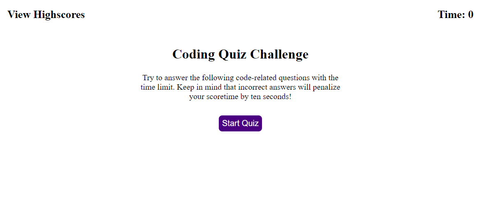

# webAPIs-codeQuiz

## Description

This application is a timed coding quiz with five single-choice questions. Each correct answer gives users 1 point. Every incorrect answer substracts 10 seconds from the timer. When game is over, any time remained are added to the final score. The application stores high scores for users to gauge their progress compared to their peers. 

## Installation

N/A

## Usage

* When users clicks start button, timer starts to count down from 75 seconds, the first single-choice question with four answers is presented.

* When user clicks one of the 4 answer buttons, whether his/her answer is correct or not is shown, and the next question is presented.
  If user answers incorrectly, ten seconds are subtracted from the timer.

* When all questions are answered or the timer reaches 0, the game is over and the final score is shown. Users are asked to input their name initials to save their scores.

* When users submit their name initials, all the previous highscores are shown. Users can clear the highscores or go back to take the quiz again.

## Sreenshot

The following image demonstrates the application appearance:

## Link to the website

https://xybai0103.github.io/webAPIs-codeQuiz/

## Credits

N/A

## Licencse

N/A